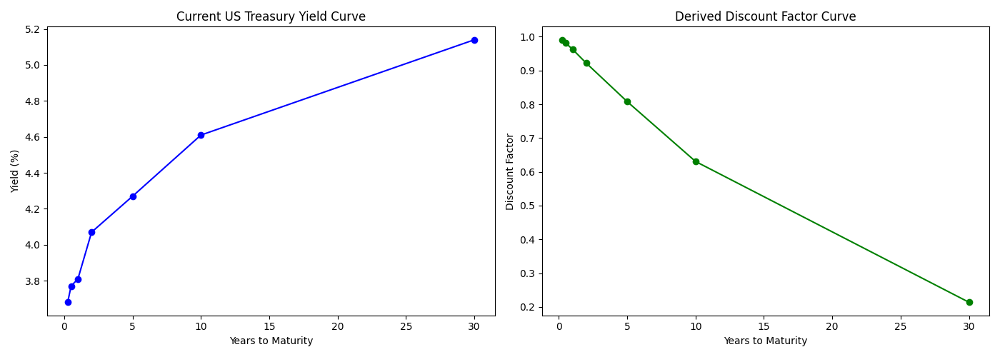

# Quantitative Finance Portfolio

This repository contains a collection of quantitative finance projects developed during my **MSc in Financial Mathematics at the University of Exeter**. 

My focus is on bridging the gap between rigorous financial theory and practical, production-level Python implementation. Each project is modularized to demonstrate competency in data engineering, mathematical modeling, and risk management.

---

## 📂 Project Summary

### 1. Black-Scholes-Merton Option Pricer
*   **Focus:** Derivative Pricing
*   **Concepts:** BSM Model, Implied Volatility, Option Greeks (Delta, Gamma, Vega).
*   **Details:** Calculates fair value for European options and visualizes Greek sensitivities.

### 2. Markowitz Portfolio Optimization
*   **Focus:** Portfolio Theory
*   **Concepts:** Modern Portfolio Theory (MPT), Efficient Frontier, Covariance Matrices, Sharpe Ratio.
*   **Details:** Uses Monte Carlo simulation across 50,000 scenarios to identify optimal asset weightings.

### 3. Geometric Brownian Motion (GBM) Simulation
*   **Focus:** Stochastic Calculus
*   **Concepts:** Drift, Diffusion, Monte Carlo Paths.
*   **Details:** Simulates asset price trajectories to estimate future probability distributions.

### 4. Value at Risk (VaR) & Expected Shortfall (ES)
*   **Focus:** Risk Management
*   **Concepts:** Historical vs. Parametric VaR, Confidence Intervals.
*   **Details:** Quantifies the maximum potential loss over a specific timeframe to assist in capital allocation.

### 5. Fixed-Income Term Structure Engine (New!)
*   **Focus:** Fixed Income & Yield Curve Construction
*   **Concepts:** Zero-Coupon Curve Bootstrapping, Discount Factors, Interpolation.
*   **Details:** Fetches raw Treasury data from FRED, constructs a continuous yield curve, prices coupon-bearing bonds, and performs DV01 sensitivity analysis.
> 

---

## 🛠️ Tech Stack
*   **Language:** Python 3.13
*   **Data Acquisition:** `yfinance`, `fredapi`
*   **Mathematical Modeling:** `numpy`, `scipy`
*   **Data Processing:** `pandas`
*   **Visualization:** `matplotlib`

---

## 🏗️ Repository Architecture
I have designed this repository to prioritize modularity and clean separation of concerns. This ensures that the codebase remains maintainable as the project grows.

*   **`Quant_Library/`**: This is the heart of the project. It contains reusable classes and functions (e.g., fixed-income calculators, portfolio metrics, simulation engines). By centralizing logic here, I avoid code duplication across different projects.
*   **`Data/`**: Keeps raw data and loading scripts separate from the analysis. This ensures that the analytical code is "data-agnostic"—it doesn't care where the data comes from, only that it matches a specific format.
*   **`Projects/`**: Contains the specific implementation scripts (the "Dashboards") that leverage the library and data to solve distinct financial problems.

## 🚀 Setup & Usage

### Prerequisites
Some projects require API keys (e.g., FRED). 
1. Create a `.env` file in the repository root.
2. Add your credentials:
   ```text
   FRED_API_KEY=your_actual_api_key_here
Installation
Clone the repository and install the dependencies:
pip install -r requirements.txt

