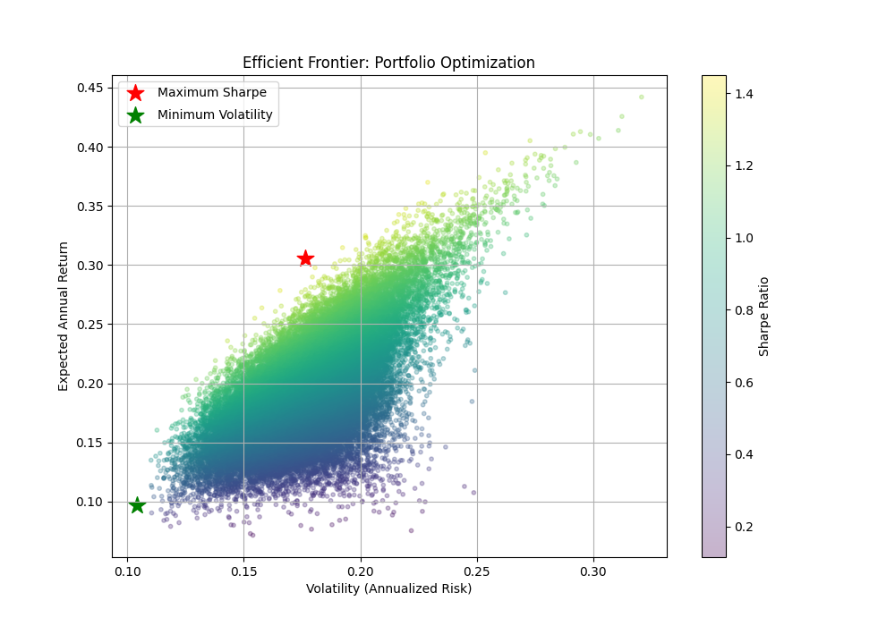
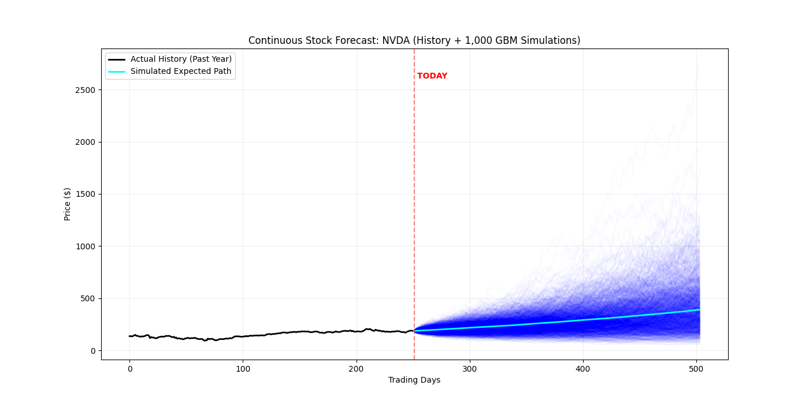

# Quantitative Finance Projects (Python)

This repository contains a collection of quantitative finance projects developed as preparation for the **MSc Mathematical Finance at the University of Exeter**. 

The goal of these projects is to bridge the gap between financial theory and practical Python implementation, focusing on option pricing, portfolio management, and stochastic simulations.

## 📂 Project Overview

### 1. Black-Scholes-Merton Option Pricer
A tool to calculate the theoretical price of European Call and Put options using the Black-Scholes-Merton model.
*   **Key Concepts:** Option Greeks (Delta, Gamma, Theta, Vega, Rho), Implied Volatility.
*   **Features:** Visualizes how option prices change relative to the underlying asset price.

### 2. Markowitz Portfolio Optimization
An implementation of Modern Portfolio Theory (MPT) to find the "Efficient Frontier" for a set of diverse equity assets.
*   **Key Concepts:** Risk vs. Return, Covariance Matrices, Sharpe Ratio, Monte Carlo Simulation.
*   **Features:** Simulates 50,000 random portfolios to identify the Maximum Sharpe Ratio and Minimum Volatility weightings.
*   **Assets used:** AAPL, NVDA, JPM, GLD, TLT, and 10 others across diverse sectors.

> 

### 3. Geometric Brownian Motion (GBM) Forecasting
A stochastic simulation engine used to model future stock price paths.
*   **Key Concepts:** Stochastic Processes, Drift, Diffusion (Volatility), Monte Carlo Forecasting.
*   **Features:** Generates 1,000 potential future price paths and connects them seamlessly to historical data for visual backtesting.

> 

## 🛠️ Tech Stack
*   **Language:** Python 3.13
*   **Data:** `yfinance` (Scraped from Yahoo Finance)
*   **Analysis:** `pandas`, `numpy`, `scipy`
*   **Visualization:** `matplotlib`

## 🚀 How to Run
1. Clone the repository.
2. Install the required dependencies:
   ```bash
   pip install -r requirements.txt